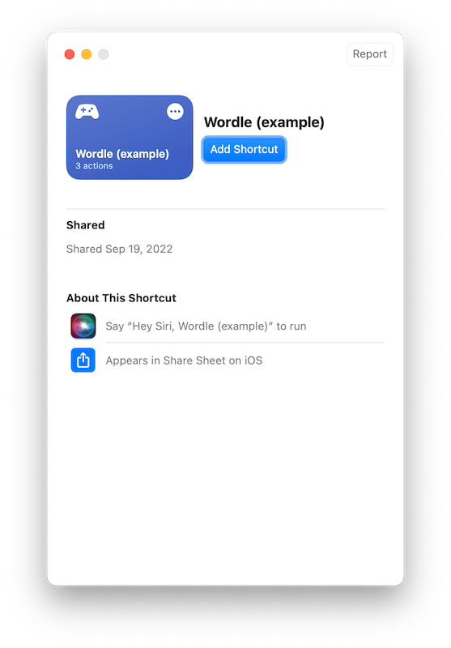

# Wordle to yaml shortcut

To quickly use the action, download the [Wordle (example).shortcut](Wordle (example).shortcut).

## Set up

When you first open the shortcut, it will ask you to enter your GitHub repository and a GitHub token.

## Using the shortcut

If playing from your phone:

1. After your next game of Wordle, click the **Share** button from the Wordle overlay.
2. Click **Wordle** from the sharesheet.
3. The shortcut will automatically create the dispatch event.

If playing from your computer:

1. After your next game of Wordle, click the **Share** button from the Wordle overlay.
2. Wordle will copy your score to the clipboard.
3. From Shortcuts, click the play icon for **Wordle** and paste your score into the input.
4. The shortcut will automatically create the dispatch event.
